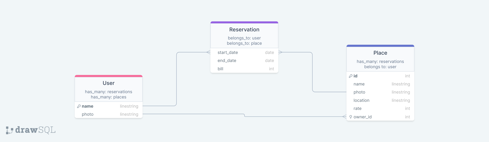

<div align="center">
  <h1><b>Book an appointment | Places</b></h1>
  
</div>

<hr>

 ## Kanban board
 - [Kanban board Project link](https://github.com/users/dennis-every/projects/3/views/2)
 
 ### Initial State of Kanban board
 

 Our group remained the same of 4 team members throughout the whole project.

<hr>

 [Backend Deployed link](https://boiling-taiga-49294-bcedd3da6f09.herokuapp.com/api-docs/index.html)
 
<hr>

# 📗 Table of Contents

- [📖 About the Project](#about-project)
  - [🛠 Built With](#built-with)
    - [Tech Stack](#tech-stack)
    - [Key Features](#key-features)  
- [💻 Getting Started](#getting-started)
  - [Setup](#setup)
  - [Prerequisites](#prerequisites)
  - [Install](#install)
  - [Usage](#usage)
  - [Run tests](#run-tests)
  - [Deployment](#triangular_flag_on_post-deployment)
- [👥 Authors](#authors)
- [🔭 Future Features](#future-features)
- [🤝 Contributing](#contributing)
- [⭐️ Show your support](#support)
- [🙏 Acknowledgements](#acknowledgements)
- [❓ FAQ](#faq)
- [📝 License](#license)

# 📖 Book an appointment | Places <a name="about-project"></a>

> The Book an appointment | Places API will provide functionality to create, read, and destroy data related to places. It will serve as the server-side component responsible for handling requests and managing the database. The React client will interact with this backend to perform actions such as creating new places and reservations, see the place details, and removing places from the system.

[Link to the Front End Repo](https://github.com/dennis-every/book-an-appointment-front-end)

## 🛠 Built With <a name="built-with"></a>

### Tech Stack <a name="tech-stack"></a>

<details>
  <summary>Client</summary>
    <ul>
    <li><a href="https://react.dev/">React</a></li>
    <li><a href="https://redux.js.org/">Redux</a></li>
  </ul>
</details>
<details>
  <summary>Server</summary>
  <ul>
    <li><a href="https://rubyonrails.org/">Ruby on Rails</a></li>
  </ul>
  </details>
  <details>
  <summary>Database</summary>
  <ul>
    <li><a href="https://www.postgresql.org/">PostgreSQL</a></li>
  </ul>
</details>

### Key Features <a name="key-features"></a>

- **Data Model**

<p align="right">(<a href="#readme-top">back to top</a>)</p>

<p align="right">(<a href="#readme-top">back to top</a>)</p>

## 💻 Getting Started <a name="getting-started"></a>

To get a local copy up and running follow these simple example steps.

### Prerequisites

> You need the following tools be installed in your computer:

> - [Rails](https://guides.rubyonrails.org/)
> - [Git](https://www.linode.com/docs/guides/how-to-install-git-on-linux-mac-and-windows/)
> - [Ruby](https://github.com/microverseinc/curriculum-ruby/blob/main/simple-ruby/articles/ruby_installation_instructions.md)


### Setup

Clone this repository to your desired folder:

```sh
cd my-prefered-folder
  
git clone https://github.com/dennis-every/book-an-appointment-api.git

```

### Install

Install this project with:

```sh
cd book-an-appointment-api
  
bundle
```

### 💾 Database

Create the databases, run migrations, and populate it with seed data:

```sh
rails db:create
rails db:migrate
rails db:seed
```

### Usage

To run the project run the following commands:

```sh
rails s
```

### Run tests

To run tests, run the following command:


```sh
rspec spec --exclude-pattern "spec/integration/api/*_spec.rb"
```
To test the API documentation, run the following command:

```sh
rake rswag:specs:swaggerize
```
<p align="right">(<a href="#readme-top">back to top</a>)</p>

## 👥 Authors <a name="author"></a>

👤 **Ashmal Zahra**

- GitHub: [@ashmalzahra](https://github.com/ashmalzahra)
- Twitter: [@AshmalZahraa](https://twitter.com/AshmalZahraa)
- LinkedIn: [ashmal-zahra](https://www.linkedin.com/in/ashmal-zahra)

👤 **Nilton Segura**

- GitHub: [@Nkaleth](https://github.com/Nkaleth)
- Twitter: [@NoeSeguraL](https://twitter.com/NoeSeguraL)
- LinkedIn: [LinkedIn](https://www.linkedin.com/in/niltonsegura/)

👤 **Dennis Every**

- GitHub: [@dennis-every](https://github.com/dennis-every)
- Twitter: [@dennis_every](https://twitter.com/dennis_every)
- LinkedIn: [dennis-every](https://www.linkedin.com/in/dennis-every/)

👤 **Diego Salamanca**

- GitHub: [dfsalam](https://github.com/dfsalam)
- LinkedIn: [Diego Salamanca](https://www.linkedin.com/in/dfsalamdev/)

<p align="right">(<a href="#readme-top">back to top</a>)</p>

## 🔭 Future Features <a name="future-features"></a>

- [ ] **Complete the CRUD for places and reservations.**

<p align="right">(<a href="#readme-top">back to top</a>)</p>

## 🤝 Contributing <a name="contributing"></a>

Contributions, issues, and feature requests are welcome!

Feel free to check the [issues page](https://github.com/dennis-every/book-an-appointment-api/issues).

<p align="right">(<a href="#readme-top">back to top</a>)</p>

## ⭐️ Show your support <a name="support"></a>

If you like this project please give it a star 😁🌟✨

<p align="right">(<a href="#readme-top">back to top</a>)</p>

## 🙏 Acknowledgments <a name="acknowledgements"></a>

Thanks to [Murat Korkmaz](https://www.behance.net/muratk) for the aswesome [design](https://www.behance.net/gallery/26425031/Vespa-Responsive-Redesign).

<p align="right">(<a href="#readme-top">back to top</a>)</p>

## 📝 License <a name="license"></a>

This project is [MIT](./LICENSE) licensed.

<p align="right">(<a href="#readme-top">back to top</a>)</p>